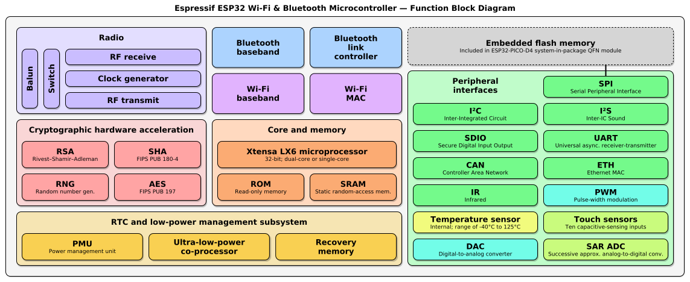

# ESP32

## Microcontroller (MCU)

A  is basically a small computer. It's a type of System on Chip (SoC). We know the CPU is the central processing unit or processor, the brain of a computer. However, the CPU needs other components to be really useful, such as RAM, I/O and flash storage. The MCU often has a CPU, main memory - RAM, and the other necessary components to execute code.

## ESP32

ESP32 is a MCU made by Espressif. It has a dual core processor clocked at 230 Mhz. It has a particular circuit to speed up the crypto algorithms like AES, SHA2 and RSA. The ESP32 has 520 KB of SRAM, Wi-Fi, bluetooth and 32 I/O pins. Those IO pins can interact with the external sensors, actuators and other things. Here is the block diagram of the ESP32 microcontroller. The ESP32 doesn't have the embedded flash itself.

## ESP32 Module
Various *ESP32 modules* are created to include the ESP32 MCU, embedded flash, crystal (for the RTC), an antenna and other components and work fully as a computer. 
A module has the flash memory so that it can contain programs, data, configuration parameters and other data.
The flash is connected to the ESP32 via the SPI bus and the supported capacity is up to 16Mb.
The official Espressif module (ESP-WROOM-32) includes a 4Mb flash memory.
A crystal is basically a clock, which is needed by the CPU to run.
An antenna is needed by Wi-Fi and bluetooth to reach a decent communication range.
Different manufacturers may integrate different components onto the module.

## ESP32 Development Board 

An ESP32 development board may contain an ESP32 module and other supporting components on a printed circuit board (PCB) so that programmers can try to become acquainted with the ESP32. We may also test our project code on the development board.
In the real world, we may have to develop our own PCB with an ESP32 MCU or an ESP32 module to achieve desired functionalities.
For example we can integrate a SD card or sensors onto the PCB so that the ESP32 is used to read the sensor data data and store it on the SD card. Ot course, the ESP32 supports WiFi and Bluetooth and can send the data over the Internet. 

This image is of the development board,  it has a so we add the micro-USB port which is used to so you can power up the development board and ESP32module easily. This micro-USB port also works as a data communication channel. You can see labeled in the image a USB-UART bridge, the ESP32 module itself doesn't support usb. We use this bridge, the USB-UART chip to convert the USB signal into a UART signal. UART is another kind of communication protocol supported by most microcontrollers. That's why we needed this bridge, this chip to convert the micro usb signal into the url signal so that the ESP32 can understand the signal. Why do we have so many legs along the sides? 

Those legs are only the extension of the legs of the microcontroller itself, there are wires from
the chips legs here to the large legs on the side of the board here . The reason this is done is  the space between two legs on the chip of the microcontroller is very so small. This makes it very hard for normal people to use. To try and solder something onto the leg of the chip is very hard, but soldering it onto the larger leg, which is connected to the chip’s leg by a wire, is much easier. The larger legs are an extension of the chip module itself as they are directly connected by a wire.

Normally you do not use a development board in the final production, it is used to test to code.

Slide 9: ESP32-WROOM-32

The ESP-WROOM-32, this is the one module made by one manufacturer and this is one kind of ESP32 module. We have the USB-UART bridge mentioned before, this provides up to 3 Mbps of transfer rates. There are two buttons on the development board. One is called reset, this means you want to restart the code execution from the beginning inside of this chip. The boot button is used when flashing the code, you push the button and you can flash your code into the chip. Sometimes you may not have to press the boot button to get the firmware download to work,if you cannot flash your code into the microcontroller you need to push the boot button. The micro-USB port acts as both a power supply and data communications cable, the cable used must contain both a power and data line. If the cable only has a power line you will be unable to communicate with the device. The IO pins, the legs on the sides of the development board, some legs are power or ground but most are for IO some will be for input, and others output. Input is sending data into the chip, and output is sending data out of the chip, most legs are for both input and output - two way communication, but some are for only input or only output.

Slide 10: Pin Layout

This is the layout for those IO pins. On the left, are all the pins. You should assume the function of this chip has a micro-USB port, and you need to orient your device to be the same as the one in the diagrams. The top left pin is a power source of 3.3V, that's why  have this cable inserted to this legs column allowing this board to serve as a power source. Our sensor needs a power source and that's why we connect the 3.3V leg to the positive leg of the sensor.

The top right pin is the  ground leg, and because we need a loop, a closed circuit both a power and a ground we connect the ground leg of the ESP32 to the negative leg of the sensor. The data leg of the sensor is connected to GPIO port 22. GPIO stands for General Purpose Input Output and GPIO22 is used for a particular communication protocol I2C. This sensor is using the I2C protocol which is why we need to connect the dataline of the sensor to GPIO22, if this is not done it will not work. Different sensors will use different protocols, you will need to look at the documentation of a particular sensor to see which pin you will need to connect it to.    

Slide 11: Chart of IO pins

This is the definition of all the IO pins and all the legs. you need to refer to this chart here to
understand the layout. 
