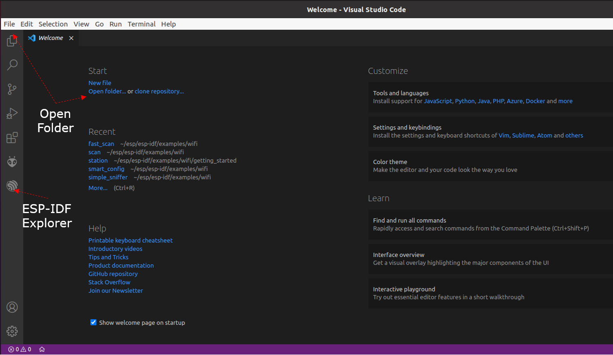
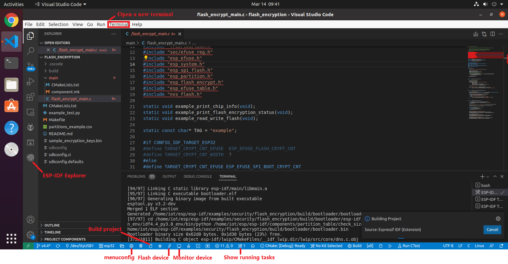

# Programming 

There are at least four options of programming for ESP32: VS Code + PlatformIO, VS Code + ESP-IDF, Native ESP-IDF programming environment, and Arduino IDE. Arduino IDE is easy to use, but with limited functionalities such as debugging. VS Code + ESP-IDF and the native ESP-IDF programming environment are essentionally the same while VS Code + ESP-IDF provides a GUI interface and a user does not need to remember various ESP-IDF commands. VS Code + PlatformIO supports both Arduino framework and ESP-IDF programming framework. An Arduino ESP32 project can be imported into VS Code + PlatformIO. The ESP-IDF fromawork under VS Code + PlatformIO is smililar to VS Code + ESP-IDF and naive ESP-IDF programming environment, but their configugration grammars are different. So we can use whatever is convenient.

## VS Code + PlatformIO

### PlatformIO--ESP-IDF framework
This is a great tutorial on using [PlatformIO with VS Code](https://docs.platformio.org/en/latest/platforms/espressif32.html#tutorials).

1. Clone [ESP-IDF Components library](https://github.com/UncleRus/esp-idf-lib)
2. Use ESP-IDF on PlatformIO: [Espressif IoT Development Framework under PlatformIO](https://docs.platformio.org/en/latest/frameworks/espidf.html#examples)
   - Adding EXTRA_COMPONENT_DIRS for ESP-IDF on the PlatformIO extension (different from the way it is added to the ESP-IDF extension). Using EXTRA_COMPONENT_DIRS option in the root CMakeLists.txt file
```
list(APPEND EXTRA_COMPONENT_DIRS esp-aws-iot)
```
3. [Get started with ESP-IDF and ESP32-DevKitC: debugging, unit testing, project analysis](https://docs.platformio.org/en/stable/tutorials/espressif32/espidf_debugging_unit_testing_analysis.html)
   - Note: follow the steps. Otherwise, errors such as monitor speed rate may happen
   - [pio\libdeps\esp32dev\DHT sensor library\DHT_U.h:36:29: fatal error: Adafruit_Sensor.h: No such file or directory](https://community.platformio.org/t/pio-libdeps-esp32dev-dht-sensor-library-dht-u-h29-fatal-error-adafruit-sensor-h-no-such-file-or-directory/21861)
     - The solution is simple. Add the following include statements to main.cpp:

``` 
#include <Adafruit_Sensor.h>
```

Using *PlatformIO* -> *Build*/*Upload* is the most reliable way to build a project and upload the firmware.


### Using Native ESP-IDF Project with PlatformIO

Here is an introduction on [Espressif IoT Development Framework](https://docs.platformio.org/en/stable/frameworks/espidf.html) within PlatformIO. Looks useful when a native ESP-IDF project is imported into PlatformIO.
- Create a PlatformIO project using the ESP-IDF framework
- Keep the platformio.ini file and remove all other files.
- Copy the native esp-idf files and folders to the PlatformIO project folder.
- Use the src_dir option in platformio.ini to to specify *main* as the folder with source files. Here is an example
```
[platformio]
src_dir = main

[env:esp32dev]
platform = espressif32
framework = espidf
board = esp32dev
```
Seems the approach works.

## VS Code + ESP-IDF
1. [Installation](https://github.com/espressif/vscode-esp-idf-extension/blob/master/docs/tutorial/install.md)
2. [Basic use of the extension](https://github.com/espressif/vscode-esp-idf-extension/blob/master/docs/tutorial/basic_use.md)

Load, build and flash an example project
- Start VS Code
- File -> Open Folder 
  - Example project: /home/iot/esp/esp-idf/examples/wifi/scan
- ESP-IDF Build project
- ESP-IDF Flash device -> UART
  - If “No such file or directory: '/dev/ttyUSB1'”, pressing F1, typing "ESP-IDF: Select port to use:" -> /dev/ttyUSB0
  - During connecting to /dev/ttyUSB0, may need to hold the BOOT (IO0) button of the ESP32 until uploading starts
  - If still errors, unplug and re-plug the kit
- ESP-IDF Monitor device
- Press reset button of the IoT kit
- File -> Close Folder
- Close a project


### Load a project
Load a project by opening the project folder.



### Build, upload firmware via icons




## Native ESP-IDF programming environment
This is a great guide on [Get Started - ESP32 - — ESP-IDF Programming Guide](https://docs.espressif.com/projects/esp-idf/en/stable/esp32/get-started/).

Set up the environment variables
```
. $HOME/esp/esp-idf/export.sh
```
