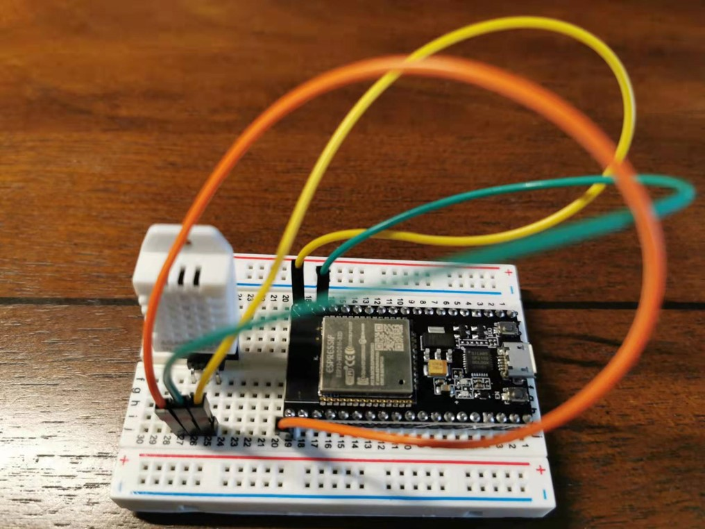

# IoT Lab Environment--Breadboard Version

This repository is dedicated to the [IoT security and privacy classes](http://www.cs.uml.edu/~xinwenfu/Teaching.html) taught by [Dr. Xinwen Fu](http://www.cs.uml.edu/~xinwenfu/index.html) of University of Massachusetts Lowell.



## Creating the environment
1. [Create Ubuntu VM from the .iso image](https://ubuntu.com/tutorials/how-to-run-ubuntu-desktop-on-a-virtual-machine-using-virtualbox#1-overview)
   - Ubuntu username: IoT; Password: toi
2. [Install VS Code](https://code.visualstudio.com/download)
3. [Install PlatformIO IDE for VSCode](https://platformio.org/install/ide?install=vscode)
4. Add the user *IoT* into the group dialout so that *IoT* can use ttyusb0
   - [Permission denied: '/dev/ttyUSB0](https://askubuntu.com/questions/133235/how-do-i-allow-non-root-access-to-ttyusb0)

```
sudo usermod -a -G dialout $USER
```
5. For ease of transferring files out of Ubuntu VM to the host computer, a [shared folder](https://net2.com/how-to-share-folders-between-your-ubuntu-virtualbox-and-your-host-machine/) can be created.

## Programming 

There are at least four options of programming for ESP32: VS Code + PlatformIO, VS Code + ESP-IDF, Native ESP-IDF programming environment, and Arduino IDE. Arduino IDE is easy to use, but is limited with functionalities such as debugging. VS Code + ESP-IDF and the native ESP-IDF programming environment are essentionally the same while VS Code + ESP-IDF provides a GUI interface and a user does not need to remember various ESP-IDF commands. VS Code + PlatformIO supports both Arduino framework and ESP-IDF programming framework. An Arduino ESP32 project can be imported into VS Code + PlatformIO. The ESP-IDF fromawork under VS Code + PlatformIO is smililar to VS Code + ESP-IDF and naive ESP-IDF programming environment, but their configugration grammars are different. So we can use whatever is convenient.

### VS Code + PlatformIO

This is a great tutorial on using [PlatformIO with VS Code](https://docs.platformio.org/en/latest/platforms/espressif32.html#tutorials).

1. Clone [ESP-IDF Components library](https://github.com/UncleRus/esp-idf-lib)
2. Use ESP-IDF on PlatformIO: [Espressif IoT Development Framework under PlatformIO](https://docs.platformio.org/en/latest/frameworks/espidf.html#examples)
   - Adding EXTRA_COMPONENT_DIRS for ESP-IDF on the PlatformIO extension (different from the way it is added to the ESP-IDF extension)
```
list(APPEND EXTRA_COMPONENT_DIRS esp-aws-iot)
```
3. [Get started with ESP-IDF and ESP32-DevKitC: debugging, unit testing, project analysis](https://docs.platformio.org/en/stable/tutorials/espressif32/espidf_debugging_unit_testing_analysis.html)
   - Note: follow the steps. Otherwise, errors such as monitor speed rate may happen
   - [pio\libdeps\esp32dev\DHT sensor library\DHT_U.h:36:29: fatal error: Adafruit_Sensor.h: No such file or directory](https://community.platformio.org/t/pio-libdeps-esp32dev-dht-sensor-library-dht-u-h29-fatal-error-adafruit-sensor-h-no-such-file-or-directory/21861)
     - The solution is simple. Add the following include statements to main.cpp:

``` 
#include <Adafruit_Sensor.h>
```

### VS Code + ESP-IDF
1. [Installation](https://github.com/espressif/vscode-esp-idf-extension/blob/master/docs/tutorial/install.md)
2. [Basic use of the extension](https://github.com/espressif/vscode-esp-idf-extension/blob/master/docs/tutorial/basic_use.md)

Load, build and flash an example project
- Start VS Code
- File -> Open Folder 
  - Example project: /home/iot/esp/esp-idf/examples/wifi/scan
- ESP-IDF Build project
- ESP-IDF Flash device -> UART
  - If “No such file or directory: '/dev/ttyUSB1'”, pressing F1, typing "ESP-IDF: Select port to use:" -> /dev/ttyUSB0
  - During connecting to /dev/ttyUSB0, may need to hold the BOOT (IO0) button of the ESP32 until uploading starts
  - If still errors, unplug and re-plug the kit
- ESP-IDF Monitor device
- Press reset button of the IoT kit
- File -> Close Folder
- Close a project


#### Load a project
Load a project by opening the project folder.


#### Build, upload firmware via icons


### Native ESP-IDF programming environment
This is a great guide on [Get Started - ESP32 - — ESP-IDF Programming Guide](https://docs.espressif.com/projects/esp-idf/en/stable/esp32/get-started/).

Set up the environment variables
```
. $HOME/esp/esp-idf/export.sh
```

## Labs
These are the labs I used in my class.

1. [ESP32 via VS Code and PlatformIO](https://github.com/xinwenfu/tst-dht-lab)
2. [ESP32 UART and Flash Hack](https://github.com/xinwenfu/ESP32-UART-and-Flash-Hack)
3. [Debugging ESP32 App with ESP-PROG: JTAG Debugger](https://github.com/PBearson/ESP32-With-ESP-PROG-Demo)
4. [Basic OTA via WiFi on ESP32](https://github.com/xinwenfu/ota)
5. [Secure ESP32 OTA through HTTPS](https://github.com/PBearson/Get-Started-With-ESP32-OTA)
6. [MITM attacks against http and https through mitmproxy](https://github.com/xinwenfu/mitmproxy-get)
7. Network Security on ESP32 through Amazon AWS IoT
   - [AWS IoT MQTT Subscribe/Publish ESP-IDF original example](https://github.com/xinwenfu/Network-Security-on-ESP32)
   - [AWS IoT MQTT Subscribe/Publish PlatformIO ESP-IDF Project](https://github.com/xinwenfu/platformio-espidf-aws-iot)
8. [ESP32 AWS IoT with ATECC608A](https://github.com/PBearson/esp-aws-iot/blob/master/README.md)
9. Secure storage
   - [ESP32 Flash Encryption Tutorial](https://github.com/PBearson/ESP32_Flash_Encryption_Tutorial)
   - [SP32 Secure Key Storage Tutorial](https://github.com/PBearson/ESP32_Secure_Key_Storage_Tutorial)
10. [ESP32 Secure Boot Tutorial](https://github.com/PBearson/ESP32_Secure_Boot_Tutorial)
